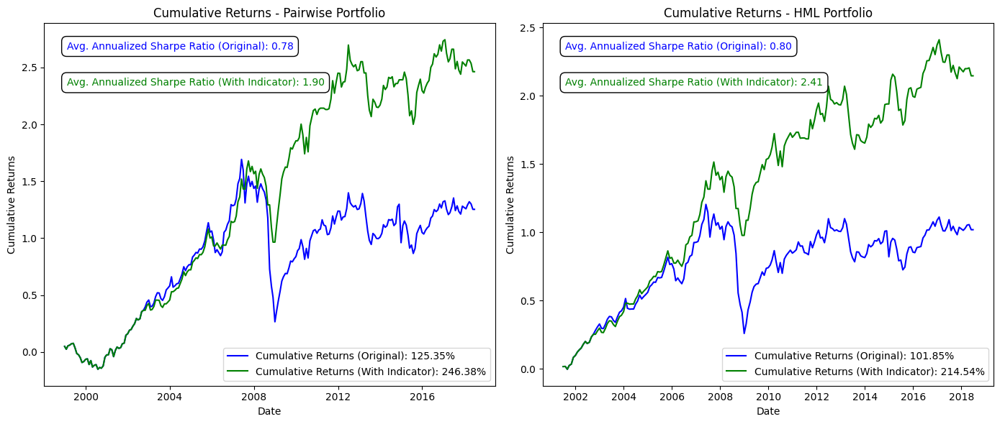

<<<<<<< HEAD

---

# **Volatility-Based Carry Trade Strategy**


## **Overview**
This project revisits the traditional carry trade strategy by incorporating a GARCH-based volatility indicator to mitigate risk during volatile market conditions. Inspired by Meese and Rogoff's random walk model and Citibank's "on-off switch," this project seeks to enhance the risk-adjusted performance of G10 currency portfolios.

Key contributions include:
- Development of a TARCH(1,1) volatility model for forecasting market conditions.
- Implementation of a dual-layer "on-off" switch for carry trade exposure based on forecasted and realized volatility.
- Comparative analysis of Pairwise and HML carry trade strategies under the volatility indicator.

---

## **Data and Modeling**
### **Original Dataset**
- The primary data, sourced from Bloomberg Terminal, includes G10 spot rates, forward rates, and interest rate premiums.
- All data is stored in the Excel file `FX_data.xlsx`. This file contains the raw monthly currency data used to calculate carry trade returns.

### **Modeling Methodology**
- Econometric modeling and testing were conducted in **EViews**, as reflected in the `.wf1` file (`carry_trade.wf1`).
- Preliminary testing included:
  - Unit root and structural break tests.
  - GARCH modeling and candidate selection using the Diebold-Mariano test.
- The TARCH(1,1) model was selected for its superior ability to capture volatility asymmetry in G10 currency portfolios.

### **Portfolio Strategies**
- **Pairwise Portfolio**: Long positions in high-interest-rate currencies and short positions in low-interest-rate currencies.
- **HML Portfolio**: Long positions in multiple high-interest-rate currencies and short positions in multiple low-interest-rate currencies, with weighting to reduce idiosyncratic risk.

---

## **Implementation of Volatility Indicator**
### **Dual-Layer Approach**
1. **Forecasted Volatility**:
   - Generated via TARCH(1,1) rolling forecasts.
   - Trades are deactivated when forecasted volatility exceeds the 90th percentile.
2. **Realized Volatility**:
   - Serves as a failsafe to deactivate trades during unanticipated volatility spikes.

Both volatility measures regulate trading activity to minimize losses during high-volatility periods while maintaining exposure during stable conditions.

---

## **Results**
### **Performance Highlights**
- **Cumulative Returns**: Indicator-adjusted portfolios exhibited greater stability and reduced drawdowns.
- **Sharpe Ratios**: Improved annualized Sharpe ratios for both Pairwise and HML portfolios under the indicator strategy.

### **Key Visualizations**

*Figure 1: Comparison of cumulative returns with and without the volatility indicator.*

---

## **How to Run**
1. Clone the repository:
   ```bash
   git clone https://github.com/markbogorad/CarryTrade.git
   cd CarryTradeStrategy
   ```
2. Install dependencies:
   ```bash
   pip install -r requirements.txt
   ```
3. Run the Jupyter Notebook:
   ```bash
   jupyter notebook VolatilityIndicator.ipynb
   ```

---

## **Future Work**
- Incorporate emerging market currencies to test the robustness of the volatility indicator.
- Explore macroeconomic drivers for additional explanatory power in volatility modeling.
- Evaluate performance under varying market regimes and longer time horizons.

---

## **Files in This Repository**
- **`FX_data.xlsx`**: The original dataset sourced from Bloomberg.
- **`carry_trade.wf1`**: EViews file containing econometric modeling and testing results.
- **`VolatilityIndicator.ipynb`**: Python implementation of the volatility-based carry trade strategy.

---

=======
# Volatility-Based Carry Trade Strategy

## Overview

This project enhances the traditional carry trade strategy by implementing a dynamic volatility-based indicator. Using advanced GARCH models, the project optimizes returns and minimizes risk during volatile market conditions.

## Methodology

GARCH Model Estimation: The TARCH model was chosen for its effectiveness in modeling volatility asymmetry in G10 currencies.
Indicator Implementation: A dual-layer volatility indicator adjusts portfolio exposure based on forecasted and realized volatility.
Portfolio Reconstruction: Portfolios were reconstructed under the indicator, showing improved cumulative returns and Sharpe ratios.

## Results

The volatility-based indicator significantly enhances the carry trade strategy by improving risk-adjusted returns and stabilizing portfolio growth.
>>>>>>> c61c7a736da19d7cd52a5e37effbc7bee3059802
